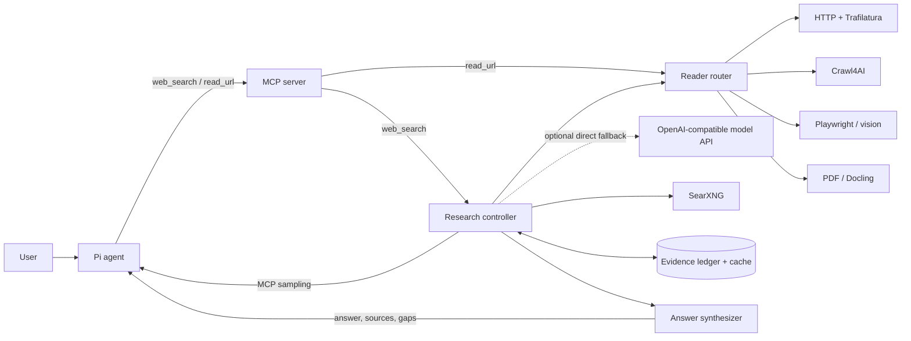

# Local agentic web research: architecture plan

## 1. Recommendation

Use the proposed stack, with two important additions:

1. Treat **SearXNG as discovery**, not as the research engine.
2. Put a **research controller and evidence ledger** between search/extraction and the answer-producing model.

The recommended stack is:

| Layer | Default | Escalation / fallback |
|---|---|---|
| External interface | MCP tools: `read_url`, `web_search` | Pi extension/adapter presents both tools to Pi |
| Research planning | Calling client's active model through MCP sampling | Optional direct OpenAI-compatible fallback, then deterministic templates |
| Discovery | Self-hosted SearXNG with JSON enabled | Pluggable direct search provider; later, specialized sources |
| Ordinary HTML | HTTP fetch + Trafilatura | Crawl4AI single-page render |
| Site exploration | Research controller selects links | Crawl4AI adaptive crawling within one site |
| Interactive/visual pages | Crawl4AI browser support | Direct Playwright, network inspection, screenshot + local vision/OCR |
| PDFs/documents | Native text extraction | Docling for layout, tables, scanned pages, and OCR |
| Retrieval/state | SQLite + FTS5, content hashes, in-memory frontier | Embeddings only if evaluation shows they help |
| Output | Synthesized answer with claim-level citations | Explicit gaps, conflicts, and failure reasons |

This is a strong local-first stack. SearXNG + Crawl4AI alone is not sufficient because neither component owns cross-domain question decomposition, source diversity, claim-level evidence, or answerability.

### Current implementation notes

The running vertical slice now adds several measured refinements to this baseline:

- An optional OpenAI-compatible native `POST /v1/rerank` client reranks each new SearXNG
  batch. It can reuse a model already served for another local project, but has no runtime
  dependency on that project. Invalid or unavailable reranker responses fall back to the lexical
  ranker and trip a per-run failure circuit instead of failing research.
- Reranker relevance is also an eligibility gate before page prefetch. Raw semantic relevance—not
  blended SERP rank or diversity bonuses—decides whether a result may consume a page read. Empty
  eligible batches trigger gap-specific query refinement, progressively relaxed floors, and only
  eventually a single low-confidence probe to retain obscure-source recall.
- Search plans carry lanes (`web`, `academic`, `community`, and `documentation`). A lane maps to a
  SearXNG category or query specialization, then retries general web search if that category has no
  results.
- Requirements can depend on other requirements and explicitly require fresh evidence. Publication
  dates retain their extraction provenance, while undated pages cannot satisfy a freshness gate.
- Structured values and opposing claim stances are checked across independent domains. Unresolved
  contradictions block sufficiency and are reported to synthesis.
- The controller follows a small number of relevant same-site links and speculatively starts the next
  few page reads. Only network/browser reads overlap; model inference and evidence mutation stay
  sequential for deterministic attribution and to avoid competing for local GPU bandwidth.
- Bundled offline fixtures exercise conflicting and corroborated evidence through
  `web-search-eval`. They are the seed of the larger calibration set described below.

Evidence-model batching is deliberately excluded for now: it would raise attribution and local GPU
contention risks without a measured latency win. PDF/visual-document handling also remains a later
reader milestone.

## 2. System boundary

Pi should see a direct reader for known URLs and a high-level research tool. Lower-level retrieval
components stay private to the service and are shared by both public tools.



Keep MCP as the portability boundary. Pi can use a project-local extension or an MCP adapter to register the resulting tool. The research server should not depend on Pi and should also work with other MCP hosts.

Do not start by launching another Pi process inside the MCP server. A purpose-built controller is easier to test, constrain, and observe. It can still be agentic: the local model proposes research requirements, queries, and next actions, while the controller validates and executes them.

## 3. Public MCP contract

Expose `read_url` for a supplied URL and `web_search` for discovery and multi-source research.
`read_url` accepts an optional focus query, a rendering policy (`auto`, `never`, or `always`), and
bounded content pagination.
It returns extracted content, HTTP and semantic page status, metadata, links, warnings, and the next
cursor. `web_search` keeps a self-contained natural-language task and a small number of policy
controls:

```json
{
  "name": "web_search",
  "description": "Research a current or web-dependent question, read enough sources to answer it, and return a cited synthesis. Preserve relative temporal wording and never add a year unless the user supplied it.",
  "inputSchema": {
    "type": "object",
    "properties": {
      "query": {
        "type": "string",
        "description": "The complete research question, including subjects, comparison criteria, constraints, locale, and desired output when relevant. Preserve latest/recent/current/today as relative wording."
      },
      "effort": {
        "type": "string",
        "enum": ["quick", "auto", "thorough"],
        "default": "auto"
      },
      "freshness": {
        "type": "string",
        "description": "Optional natural-language time constraint, such as 'current as of today' or 'published since 2025'."
      }
    },
    "required": ["query"],
    "additionalProperties": false
  }
}
```

At invocation time, the server reads its local calendar date and supplies it as `current_date` to
every model stage. Relative temporal requests are anchored to that value rather than the model's
training horizon. Explicit dates in the user's request remain constraints and are never rewritten.

`effort` selects an immutable pipeline profile rather than branching throughout the controller.
Each profile assembles the same reusable spec-building, query-planning, reranking, retrieval,
evidence-extraction, follow-up, and synthesis stages with different strategies and ceilings.
`quick` chooses the low-latency strategies, while `thorough` adds a wider source mix, lower tolerance
for missing comparison cells, and a higher time/page ceiling. `auto` routes heuristic fact tasks to
the quick profile and all broader task classes to the standard profile; it does not select thorough
automatically because that can create a surprising long-running call.

Return human-readable Markdown as the normal tool content and mirror the important fields in structured content:

```json
{
  "research_id": "01...",
  "answer_markdown": "...",
  "sources": [
    {
      "id": "S1",
      "title": "...",
      "url": "https://...",
      "published_at": "2026-08-20",
      "retrieved_at": "2026-08-22T12:00:00Z",
      "supports": ["C1", "C4"]
    }
  ],
  "coverage": {
    "status": "sufficient",
    "score": 0.91,
    "unresolved_gaps": [],
    "conflicts": []
  },
  "outcome": "success",
  "retryable": false,
  "stop_reason": "requirements_satisfied_and_saturated",
  "stats": {
    "search_queries": 6,
    "pages_fetched": 14,
    "distinct_domains": 8,
    "elapsed_ms": 73420,
    "browsing_elapsed_ms": 18400
  },
  "warnings": []
}
```

The answer should not dump full pages into Pi's context. Return the synthesis, compact supporting excerpts when useful, source metadata, and honest gaps. Persist full extraction artifacts under the `research_id` for debugging and cache reuse.

`outcome=no_evidence` and `outcome=backend_unavailable` describe the research run and do not impose
a fallback policy on the MCP host. Store upstream SearXNG engine diagnostics with the run, retry
aggregate engine failures briefly, and stop after repeated empty searches instead of exhausting the
research budget.

## 4. Internal data model

### 4.1 Research specification

The first model call converts the request into a typed `ResearchSpec`:

```text
task_type: fact | explanation | comparison | recommendation | current_event | exploration
subjects: entities or products being researched
requirements: atomic questions that must be answered
comparison_dimensions: empty unless applicable
source_policy: source-count/independence/recency/diversity requirements
time_scope and locale
exclusions and user constraints
desired answer shape
```

Each requirement has an importance (`required`, `important`, or `optional`) and an evidence rule. Examples:

- A product specification may target manufacturer documentation, without treating domain ownership
  as an automatically verified evidence property.
- A subjective comparison dimension requires independent evidence.
- A current price requires a retrieval timestamp and market/region.
- A disputed factual claim requires corroboration or an explicit conflict note.

### 4.2 Evidence ledger

Store evidence as claims, not as an undifferentiated pile of Markdown:

```text
Claim
  id
  normalized statement
  subject and comparison dimension
  stance: supports | refutes | contextualizes
  source_id
  exact excerpt or structured value
  page location / heading
  published_at and retrieved_at
  unverified descriptive source class: primary | expert | independent review | news | forum | unknown
  extraction method
  confidence and extraction warnings
```

Every statement in the final answer must map to one or more evidence IDs. A deterministic citation validator rejects source IDs that were not fetched or claims that lack supporting passages.

### 4.3 Coverage matrix

For a normal question, this is a list of requirements. For a comparison, it becomes a matrix:

```text
                     price   dimensions   compatibility   warranty   real-world use
Product A              ✓         ✓              ✓             ✓            ?
Product B              ✓         ✓              ✓             ?            ✓
Product C              ✓         ✓              ✓             ✓            ✓
```

The controller searches for the missing, high-impact cells. This is much more reliable than asking the model whether it has read "enough pages."

## 5. Adaptive research loop

```text
compile request into ResearchSpec
        ↓
generate query families and source requirements
        ↓
search SearXNG; canonicalize, cluster, and rank candidates
        ↓
select the candidate with the best expected information gain
        ↓
fetch through the reader router
        ↓
extract claims; update evidence ledger and coverage matrix
        ↓
check hard gates, answerability, conflicts, and saturation
        ├── insufficient → refine query / fetch next candidate / follow useful link
        └── sufficient   → synthesize, validate citations, return
```

### 5.1 Query families

Do not issue one generic query and read its first results. Generate query families tied to gaps:

- Publisher-authored documentation and release material.
- Independent sources and reviews.
- Exact requirement or comparison dimension.
- Known disagreement or failure modes.
- Freshness/region-specific queries where relevant.

SearXNG pagination is used only when the existing candidate frontier lacks high-value pages. Search-result rank is a feature, not the selection rule.

### 5.2 Candidate ranking

Approximate the value of fetching a page as:

```text
expected_gain =
    probability_of_filling_a_gap
  × importance_of_that_gap
  × source_quality
  × source_independence
  × estimated_novelty
  ÷ expected_cost_and_failure_risk
```

The first version can implement these as transparent heuristics. It does not need a learned ranker:

- BM25 relevance between result title/snippet and uncovered requirements.
- Source-type and domain priors.
- Penalty for already-seen domains, syndicated copies, and near-duplicate snippets.
- Bonus for a missing product/criterion cell.
- Penalty for pages likely to require an expensive browser fallback.

### 5.3 Stopping policy

Use three kinds of stopping condition together.

#### Hard safety ceilings

These prevent runaway work. They are not targets:

| Mode | Initial ceiling to calibrate | Purpose |
|---|---:|---|
| Quick | 15 active browsing seconds, 1 search call, 2 fetched pages | Simple lookup |
| Auto | 2 active browsing minutes, 8 search calls, 20 fetched pages | Normal research/comparison |
| Thorough | 10 active browsing minutes, 20 search calls, 60 fetched pages | Broad or high-confidence research |

Active browsing time counts search and document-retrieval waits, not model inference or approval
latency. Model requests have their own timeout. Also cap redirects, bytes per response, pages per
domain, browser interactions, document pages, model tokens, and concurrent fetches.

The quick profile constructs a heuristic one-requirement spec, searches the original request once,
uses deterministic candidate ranking and verbatim-excerpt evidence extraction, does not discover
links or plan follow-up queries, and retains the shared cited-answer synthesizer. This reduces the
normal path to one model round trip while keeping fetched-source and citation validation guarantees.
The standard and thorough profiles use model-built requirements and queries, optional semantic
reranking, per-document model evidence extraction, gap-driven follow-ups, and link discovery.

`thorough` additionally requires a breadth floor of three distinct search calls and six usable
source domains before sufficiency/saturation may stop the run. Claim statements must be supported
by their verbatim excerpts, including exact numeric and date tokens. Primary-source classifications
are conservatively checked against the researched subject's domain or subject-owned paths on known
publishing platforms. Canceled calls finalize their ledger row regardless of the active model or
browsing stage.

#### Mandatory answerability gates

Do not stop while any of these apply:

- A required coverage item has no usable evidence.
- A decision-driving comparison cell is missing without being explicitly reported as unavailable.
- A factual comparison uses inconsistent definitions, regions, units, or dates.
- An important contradiction is unresolved or unreported.
- A final claim would cite only a search snippet rather than a fetched source.

For product comparisons, useful default rules are:

- Manufacturer documentation for specifications when useful, without an official-source gate.
- Independent sources for subjective claims and real-world behavior.
- Fresh, region-matched sources for price and availability.
- Each mandatory product × criterion cell is either supported or explicitly marked unknown.
- Syndicated copies count as one source family, not several independent sources.

#### Diminishing-return gates

Stop when all mandatory gates pass and one of these is true:

- The best remaining candidate has expected gain below a threshold.
- The last several useful fetches added no new high-priority claims.
- Query reformulation produces mostly already-seen sources.
- The top answer/shortlist remains stable across consecutive checkpoints.
- Coverage and answerability remain above threshold for two checkpoints.

Crawl4AI's adaptive coverage/consistency/saturation logic can be used when exploring one site. The research controller must apply analogous logic across queries and domains.

The local model may propose `continue` or `stop`, but the controller owns the final decision. The model must return a structured explanation referencing uncovered requirement IDs and evidence IDs; the controller verifies them.

### 5.4 Discovering how many products to compare

If the user names the products, the set is fixed. If the user asks for "the best" products:

1. Run a breadth-first candidate-discovery phase across several query families.
2. Normalize product names and variants.
3. Score candidates against the user's constraints, not merely mention count.
4. Freeze the shortlist when it remains stable across two discovery rounds and new candidates fail the inclusion threshold.
5. Re-open discovery if later evidence disqualifies a shortlisted product.

A maximum shortlist size remains a safety/configuration cap, not the criterion for sufficiency.

## 6. Reader and navigation router

Route by content type and observed failure rather than launching Chromium for everything.

### Tier 0: URL and response safety

- Permit only `http` and `https`.
- Resolve DNS and block loopback, private, link-local, multicast, and cloud-metadata addresses before the request and after every redirect.
- Limit redirects, body size, decompression ratio, and content types.
- Use an isolated cookie jar and no personal browser profile.

### Tier 1: cheap HTTP extraction

Use an async HTTP client, retain response metadata and raw HTML in the cache, and run Trafilatura for main content, metadata, links, and tables.

Escalate when extraction is empty/very short, the required terms are absent despite a relevant result, the page is an application shell, or visible metadata indicates gated/partial content.

### Tier 2: rendered page

Use Crawl4AI for JavaScript rendering, cleaned Markdown, DOM/links, and single-page interaction hooks. Use its adaptive crawler only for a relevant hub, documentation site, or multi-page resource where following same-site links is likely to close a known gap.

### Tier 3: direct browser investigation

Use the Playwright library internally when explicit navigation is required:

- Click a tab or "load more."
- Inspect rendered DOM and JSON-LD.
- Observe relevant JSON/network responses.
- Scroll an infinite list within a strict interaction budget.
- Capture a full-page or element screenshot.

Do not expose arbitrary JavaScript execution to the research model. Give it typed actions such as `click(element_id)`, `scroll(direction)`, `read_dom()`, and `capture_screenshot()`; validate every action.

### Tier 4: document and vision path

- For PDFs with a good text layer, use a lightweight native parser first.
- Use Docling for complex layouts, tables, multi-column documents, or scanned pages.
- Apply OCR only to pages or regions without usable text.
- Use a local vision model for charts, canvas content, or a page whose meaning is intrinsically visual.

### Tier 5: alternate representation

Try a print view, RSS/Atom feed, public API, downloadable document, or another authoritative source. Do not attempt to defeat CAPTCHAs, paywalls, authentication, or deliberate bot blocking.

## 7. Model roles

Use the calling Pi session's active model initially, but keep four logical roles separate in code
and prompts:

1. **Request compiler** — produces `ResearchSpec`.
2. **Planner** — proposes queries and the next gap-closing action.
3. **Evidence analyst** — extracts normalized claims from retrieved passages.
4. **Synthesizer/judge** — assesses answerability and writes the cited response.

All outputs should use validated JSON schemas. The model never receives network credentials, browser profile data, or arbitrary filesystem/shell tools.

The default path is MCP sampling without a model hint. Pi's MCP adapter therefore resolves each
request to the active session model, so the research service is provider-independent and follows
model changes made in Pi. A dedicated evidence analyst may be selected from a separately configured
OpenAI-compatible endpoint in the operator console. This does not place a model ID in Pi's MCP
configuration: only page-evidence extraction uses the saved model, while all other roles remain
dynamic through MCP sampling. Evidence-model failures fall back to the active Pi model and trip a
per-run circuit breaker after repeated failures. The same direct endpoint remains available as a
whole-service fallback when the MCP client does not advertise sampling. Deterministic planning and
synthesis remain the final failure fallback.

The operator console and MCP process load the same project `.env`; process-level environment
variables override file values. The saved evidence-model selection contains only the endpoint and
model ID, while endpoint credentials remain in `.env` or the process environment. Results and trace
events record evidence-model attempts, successes, failures, fallbacks, and circuit-breaker state.

Sampling must remain text-only and bounded. The adapter should forward cancellation and enforce its
normal authorization policy. A trusted local Pi scope may enable automatic sampling approval because
one research run uses several role-specific calls; otherwise the user must approve every request and
response.

## 8. Storage and caching

Use SQLite for the first implementation:

- `research_runs`
- `queries`
- `search_results`
- `documents`
- `chunks` (FTS5)
- `claims`
- `requirements`
- `citations`
- `events`

Canonicalize URLs, but preserve the original URL and redirect chain. Deduplicate with canonical URL, normalized title, registrable domain, and content hashes. Track syndication/source families separately from domains.

Cache search responses briefly and page content according to freshness policy. Never silently reuse stale price/news content. Record `retrieved_at` on every source.

### Storage as implemented

The tables that exist today are `search_cache`, `document_cache`, `research_runs`, `events`, and
`engine_health`. The remaining tables above remain planned and are not created implicitly.

Every cache is bounded three ways, because a cache with no ceiling grows until it is investigated:

- TTL, enforced by deletion rather than by filtering on read. Checking `stored_at` at query time
  hides stale rows while the file keeps growing.
- A row-count ceiling per table.
- A per-row payload ceiling, which evicts rows that are too large even while fresh.

Pruning runs amortised on write, and `web-search-maint` prunes plus compacts on demand. In WAL
mode compaction must checkpoint explicitly, otherwise freed pages stay in the `-wal` sidecar and
the database keeps reporting its previous size after the rows are gone.

`engine_health` records upstream-engine cooldowns against wall-clock time. Monotonic values have an
arbitrary origin per process, so persisting one would make every restored cooldown either already
expired or permanently stuck. Persisting them means a restart does not look healthy merely because
memory was cleared, and `web-search-doctor` can report what the running server learned.

Start with FTS5/BM25. Add embeddings only after an evaluation shows missed evidence that lexical retrieval would have recovered. This keeps the first system small and fully local.

## 9. MCP lifecycle and Pi integration

For the first version:

- Use a normal blocking MCP tool call with progress notifications over the 2025-11-25 handshake
  protocol, preserving the duplex sampling back-channel needed by the adaptive loop.
- Honor cancellation immediately in the controller, pending fetches, browser, and model calls.
- Stream compact progress such as "searching publisher documentation," "8/12 requirements covered," and "checking a conflict."
- Keep `auto` mode short enough to fit typical client/tool timeouts.

MCP Tasks are attractive for thorough jobs because they provide durable task IDs, polling, progress, cancellation, and optional input requests. Treat them as a later enhancement because they are an extension and client support varies. Keep an internal job abstraction now so a blocking call can be promoted to a task without rewriting the controller.

The 2026-07-28 protocol replaces imperative server-to-client sampling during a tool call with
multi-round input-required results. Supporting that protocol without constraining research to a
static resolver graph requires making the controller resumable and persisting its frontier between
rounds. Until then, the stdio entry point must force handshake-era negotiation; Pi's adapter supports
this fallback automatically.

Pi's extension API already supports registering custom tools, streaming updates, and receiving an abort signal. The Pi-side adapter should:

- Register only `web_search`.
- Advertise sampling and resolve hint-free requests to Pi's current model.
- Forward the tool arguments to the MCP server.
- Map Pi's abort signal to MCP cancellation.
- Map MCP progress to Pi's `onUpdate` callback.
- Render only compact progress and the final cited answer.

If the chosen Pi MCP adapter does not correctly map cancellation/progress, a tiny project-local Pi extension that calls the research service directly is the safest initial integration. MCP remains the server's canonical interface.

## 10. Safety and trust boundaries

Web content is untrusted data. Enforce these in code, not only in prompts:

- Strip or quarantine instructions embedded in pages; never let them change the research policy.
  Quoted page text is fenced in `prompts.py`, and the fence markers inside that text are rewritten
  so content cannot close its own quarantine; header fields collapse newlines so a hostile page
  title cannot forge a provenance line. This is enforced in code, with tests.
- No shell, arbitrary JavaScript, unrestricted downloads, or filesystem access for the research model.
- SSRF protections across DNS resolution and redirects.
- Isolated, ephemeral browser context without user logins.
- Domain-level concurrency and polite rate limits; respect site policies and robots rules where applicable.
- Read-only navigation; no form submission, purchase, account changes, or messages.
- Quarantine downloaded files and enforce type/size limits.
- Store secrets only in process configuration and redact them from traces.
- Make blocked, paid, unavailable, and contradictory evidence visible in the final response.

## 11. Observability and evaluation

Every run should produce a replayable event trace:

- Compiled requirements and source policy.
- Queries and SearXNG engine/result metadata.
- Candidate scores and why a page was chosen.
- Fetch/extraction tier, latency, bytes, and failures.
- Claims added, coverage changes, and contradictions.
- Model decisions and schema-validation failures.
- Final stop reason and budget usage.

Create a small evaluation set before tuning thresholds. It should include:

- Simple facts.
- Current news or software information.
- Multi-product comparisons with several criteria.
- Official documentation research.
- JavaScript-heavy and poorly accessible sites.
- PDFs with tables and scanned pages.
- Duplicate/syndicated articles.
- Conflicting sources.
- Prompt-injection pages.
- CAPTCHA/paywall/blocked cases.

Measure:

- Claim support rate and citation correctness.
- Required-facet and comparison-cell coverage.
- Source independence and domain diversity.
- Unsupported-claim rate.
- Pages, searches, time, tokens, and browser escalations.
- Premature-stop and needless-continue rates.
- Cache freshness errors.

Stopping thresholds should be calibrated from these results, not selected by intuition alone.

## 12. Repository layout

```text
web-search/
├── pyproject.toml
├── README.md
├── ARCHITECTURE.md
├── config.example.toml
├── src/web_research/
│   ├── server.py                 # MCP surface
│   ├── config.py
│   ├── models.py                 # Pydantic contracts
│   ├── controller.py             # state machine and budgets
│   ├── stopping.py               # deterministic gates
│   ├── ranking.py
│   ├── citations.py
│   ├── synthesis.py
│   ├── search/
│   │   ├── base.py
│   │   └── searxng.py
│   ├── readers/
│   │   ├── router.py
│   │   ├── http.py
│   │   ├── crawl4ai.py
│   │   ├── playwright.py
│   │   └── documents.py
│   ├── model/
│   │   ├── client.py
│   │   └── prompts/
│   ├── storage/
│   │   ├── sqlite.py
│   │   └── migrations/
│   └── safety/
│       ├── urls.py
│       └── content.py
├── integrations/pi/
│   └── web-search.ts
├── tests/
│   ├── unit/
│   ├── integration/
│   ├── fixtures/
│   └── evals/
└── docker/
    └── searxng/
```

## 13. Build order

Status as implemented: milestones 0, 1, and 2 are complete (SearXNG adapter, HTTP/Trafilatura
reader, research spec and evidence ledger, coverage and independence rules, information-gain
ranking, adaptive stopping, citation validation, evaluation harness, SQLite persistence).
Milestone 3 is partial: rendered-page fallback and SSRF/redirect revalidation ship, while
adaptive same-site crawling, typed Playwright interaction, and browser network inspection do not.
Milestones 4 and 5 have not started. The sections below are kept as the reasoning behind the
ordering, not as a task list.

The ordering holds for one reason: Pi/MCP/tool-call compatibility is the highest integration risk,
so proving the interface before writing research logic keeps later changes cheap.

### Milestone 0: prove the interfaces

1. Run SearXNG locally and enable JSON output.
2. Confirm result pagination, language, time filters, and enabled engines.
3. Make one minimal MCP `web_search` call from the intended Pi adapter.
4. Confirm cancellation, timeout behavior, maximum tool-result size, and progress rendering.
5. Confirm the selected model reliably produces and consumes the tool call.

This spike should happen before building the research logic because Pi/MCP/tool-call compatibility is the highest integration risk.

### Milestone 1: useful vertical slice

- SearXNG adapter.
- HTTP + Trafilatura reader.
- `ResearchSpec`, requirement list, evidence ledger, and SQLite cache.
- Query refinement and candidate deduplication.
- Simple deterministic stopping gates plus hard ceilings.
- Final synthesis with citation validation.
- No browser, OCR, embeddings, or nested crawling yet.

This should already outperform "search snippets returned to Pi."

### Milestone 2: comparisons and adaptive stopping

- Product × criterion coverage matrix.
- Source-type/independence rules.
- Contradiction tracking.
- Expected-information-gain ranking.
- Stable-shortlist discovery.
- Saturation and two-checkpoint answerability rules.
- Evaluation harness and threshold calibration.

### Milestone 3: difficult web pages

- Crawl4AI rendered-page fallback.
- Crawl4AI adaptive same-site crawling.
- Direct Playwright interaction with typed actions.
- Network/JSON inspection.
- Strong SSRF and browser isolation tests.

### Milestone 4: documents and visual content

- Native PDF extraction.
- Docling route for layouts/tables/scans.
- OCR and local vision only when required.
- Table/value validation and document-specific citations.

### Milestone 5: operational polish

- MCP Tasks when the Pi client path supports them.
- Persistent/durable job store.
- Multiple discovery providers behind the search adapter.
- Per-domain policies, cache administration, and richer traces.

## 14. The first implementation target

Begin with this deliberately narrow behavior:

> Given a self-contained research question, generate up to several gap-specific SearXNG queries, fetch promising pages with HTTP + Trafilatura, maintain a requirement/evidence ledger, stop when all required items are supported and recent fetches add no important evidence, then return a compact cited answer.

Do not begin with browser automation or a general-purpose subagent framework. Once the vertical slice has measured failure cases, add Crawl4AI specifically for the pages the fast path cannot read. This sequence validates the part that matters most—the research and stopping logic—before adding the expensive fallbacks.
